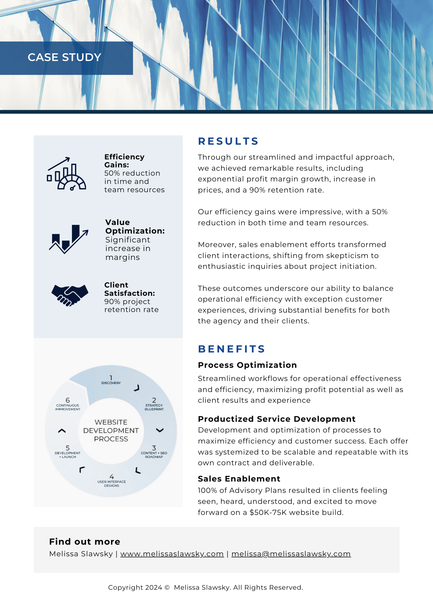
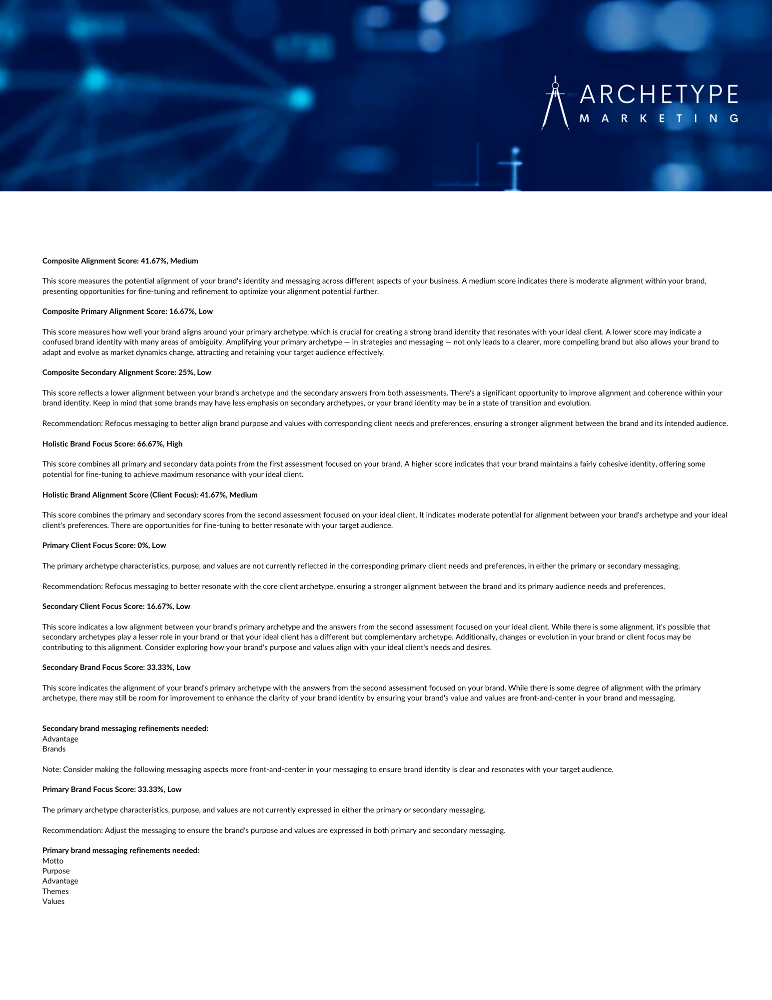
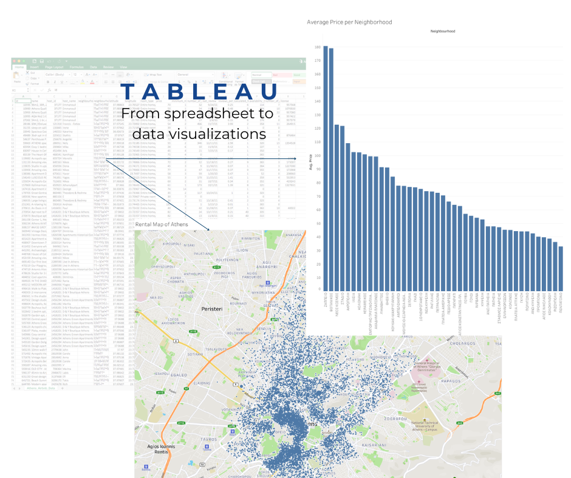
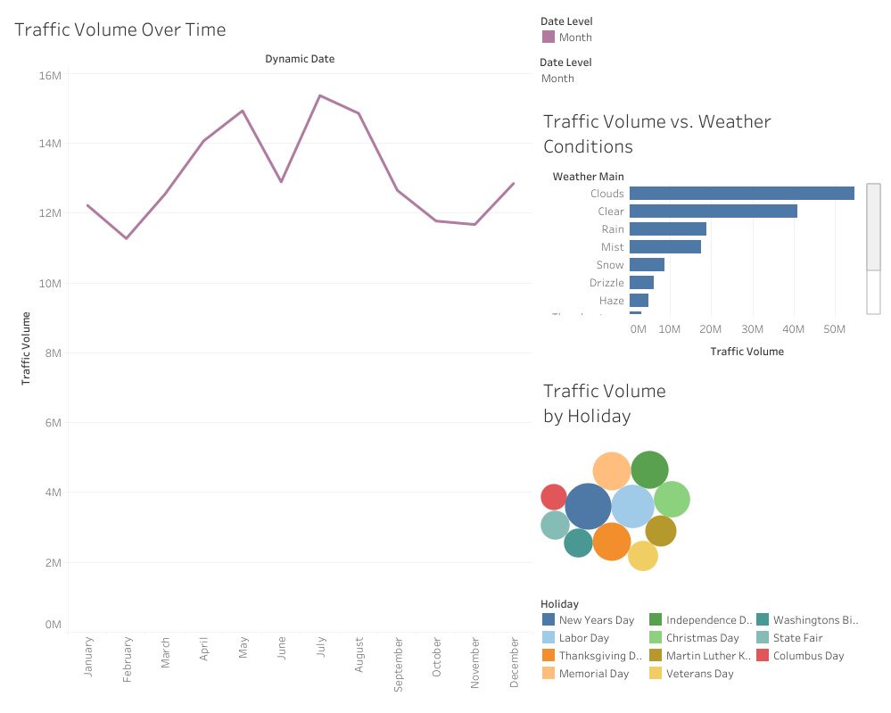

# Melissa Slawsky, Ph.D., MBA

Hi, I'm Melissa Slawsky. 

## About 👤
Strategy and operations leader accelerating value, growth, and performance for forward-thinking organizations navigating critical inflection points. 

## Current Focus 🔬
- Strategic growth frameworks and performance analytics
- Real-time dashboard development for proactive decision-making
- Data-driven optimization systems for scaling operations
- Converting analytics into actionable business intelligence

## Portfolio Highlights 🔎

### 1. Scaling Operations: From Advisory to Analytics
Showcasing progression from service design to data-driven insights, highlighting automation and efficiency gains while maintaining quality.

 
 
 

[View Project Overview](https://github.com/mslawsky/consumer-insights-and-analytics-evolution)
- Service Design & Process Optimization
- Analyzed qualitative and quantitative data to uncover customer behavior patterns
- Developed advanced algorithms aligning business value with user needs
- Delivered actionable insights through real-time analytics and intuitive dashboards

___
### 2. Expanding Market Reach: Data-Driven Growth Analysis
Strategic market analysis leveraging business intelligence to identify growth opportunities and optimize market positioning.

[View Full Project](https://github.com/mslawsky/market-analysis-airbnb-athens)

- Transformed Excel data into interactive visualizations revealing pricing trends and market opportunities
- Mapped geographical concentrations to identify underserved neighborhoods
- Developed data-driven framework for strategic market expansion
- Created stakeholder-ready dashboards enabling informed decision-making
  
___
### 3. Evolving for Sustainability: 80/20 Performance Optimization
Implementation of 80/20 analysis for sustainable growth, demonstrating systematic approach to value creation.

[View Full Project](https://github.com/mslawsky/google-fiber-dashboard-analytics)
- Applied 80/20 principle for 75% performance improvement
- Created interactive Tableau dashboards for real-time insights
- Developed data-driven recommendations for resource optimization

___
### 4. Efficient Resource Allocation: Highway Infrastructure Study
Leveraging traffic pattern analysis to optimize infrastructure planning and resource allocation
[View Full Project](https://github.com/mslawsky/traffic-volume-study/blob/main/README.md)

- Created interactive dashboards visualizing peak traffic periods and weather impacts
- Developed data-driven framework for strategic resource deployment
- Identified optimization opportunities through temporal and condition-based analysis
- Generated actionable recommendations for sustainable infrastructure planning

___
### 5. Qualitative Insights for Program Enhancement
[View Full Project](https://github.com/mslawsky/qualitative-dissertation-research)

- Analyzed 20+ hours of interview data
- Developed comprehensive thematic framework using qualitative data analysis
- Published dissertation exploring experiential learning

## Skills & Expertise 📐

  
💡 Strategic Innovation

  
  ### Systems
  - Innovation Systems
  - Tech-enabled Consulting
  - Value Modeling
  
  ### Process
  - Performance Optimization
  - Workflow Automation

  
📊 Analytics & Intelligence

  
  ### Tools
  - Business Intelligence
  - Advanced Analytics
  - Real-time Dashboards
  
  ### Platforms
  - Tableau
  - BigQuery
  - Airtable

  
🔄 Operations Excellence

  
  ### Design
  - Process Optimization
  - System Design
  - Resource Allocation
  
  ### Monitoring
  - Performance Analytics
  - Real-time Insights

  
🔍 Research Methods

  
  ### Analysis
  - Qualitative Methods
  - Quantitative Analysis
  - Thematic Coding
  
  ### Applications
  - Interview Methods
  - Market Intelligence
  - Pattern Recognition

## Contact 📧
- [LinkedIn Profile](https://www.linkedin.com/in/melissaslawsky/)
- [Professional Website](https://melissaslawsky.com/client-results/)
- [Tableau Portfolio](https://public.tableau.com/app/profile/melissa.slawsky1925/vizzes)
- [Substack Writings](https://melissaslawsky.substack.com/)
- [Email](mailto:melissa@melissaslawsky.com)

---
© Melissa Slawsky 2024. All Rights Reserved.
