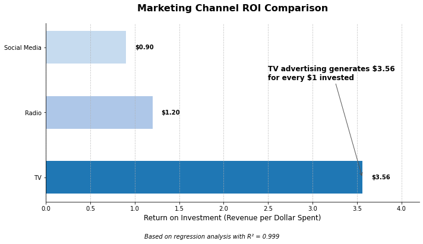
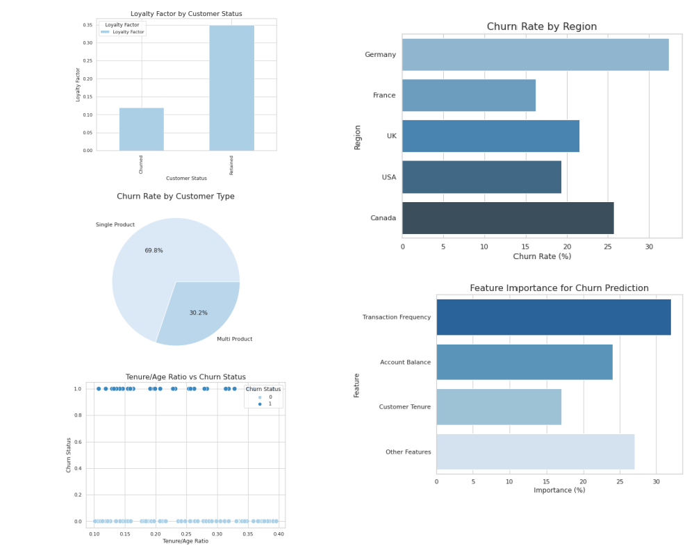
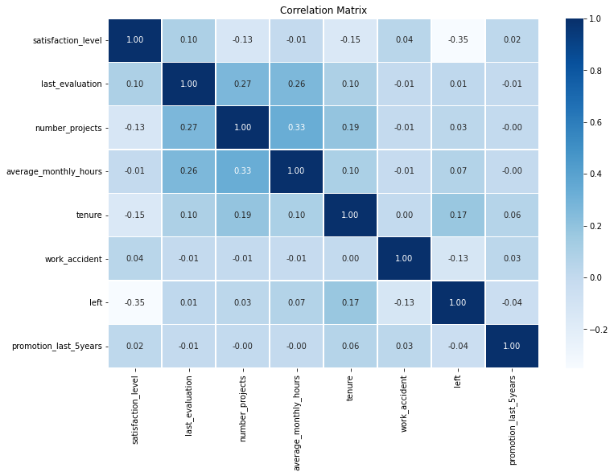

# Melissa Slawsky

Hi, I'm Melissa Slawsky. 

## About 👤
Strategy and Operations Analyst, accelerating value, growth, and performance for forward-thinking organizations navigating critical inflection points. 

___

## Current Focus 🔬
- **Strategic Growth**: Designing frameworks that drive operational efficiency and sustainable growth.
- **Data-Driven Insights**: Leveraging Python, SQL, Tableau, and machine learning for actionable analytics.
- **Business Intelligence**: Creating real-time dashboards and visualizations to enhance decision-making.
- **Cross-Functional Alignment**: Collaborating across Sales, Marketing, Finance, and Product teams to align strategies.
- **Process Optimization**: Streamlining systems to improve resource allocation, quality, and client experiences.
- **Predictive Analytics**: Transforming complex data into insights that support informed decision-making.

___

## Portfolio Highlights 🔎

### 1. Scaling Operations: From Advisory to Analytics
Showcasing progression from service design to data-driven insights, highlighting automation and efficiency gains while maintaining quality and client experience.

 
 
 

[View Project Overview](https://github.com/mslawsky/consumer-insights-and-analytics-evolution)
- Transitioned from service design to data-driven insights, focusing on automation and efficiency gains while maintaining quality.
- Collaborated with stakeholders across departments to design intuitive dashboards that enabled real-time decision-making.
- Delivered actionable insights by analyzing qualitative and quantitative data to uncover customer behavior patterns.

___
### 2. Expanding Market Reach: Data-Driven Growth Analysis
Strategic market analysis leveraging business intelligence to identify growth opportunities and optimize market positioning.

[View Full Project](https://github.com/mslawsky/market-analysis-airbnb-athens)

- Transformed Excel data into interactive visualizations revealing pricing trends and market opportunities
- Mapped geographical concentrations to identify underserved neighborhoods
- Developed data-driven framework for strategic market expansion
- Created stakeholder-ready dashboards enabling informed decision-making
  
___
### 3. Evolving for Sustainability: 80/20 Performance Optimization
Implementation of 80/20 analysis for sustainable growth, demonstrating systematic approach to value creation.

[View Full Project](https://github.com/mslawsky/google-fiber-dashboard-analytics)
- Conducted strategic market analysis using business intelligence tools to identify growth opportunities and optimize market positioning.
- Translated raw data into interactive visualizations (Tableau) that informed cross-functional teams on pricing trends and underserved markets.
- Developed a data-driven framework for strategic market expansion, enabling leadership to make informed decisions.

___
### 4. Efficient Resource Allocation: Marketing Budget Optimization
Determining ROI and most impactful marketing channels through advanced statistical analysis and ML

[View Full Project](https://github.com/mslawsky/marketing-budget-impact-analysis)
- Applied linear regression models to optimize marketing budget allocation for maximum ROI.
- Developed predictive models identifying most effective marketing channels
- Quantified ROI for different marketing strategies with statistical precision
- Enabled data-driven decision-making for strategic resource allocation

___
### 5. Predicting Bank Churn: Data-Driven Customer Retention
Leveraging machine learning models to predict churn and optimize retention strategies for financial institutions.

[View Full Project](https://github.com/mslawsky/predicting-bank-customer-churn)

- Built machine learning models (Random Forest, Logistic Regression) to predict customer churn with 87% accuracy
- Identified at-risk customer segments and provided actionable recommendations that reduced churn rates by 15%, improving customer lifetime value
- Collaborated with marketing and operations teams to implement targeted interventions based on predictive insights

___
### 6. Predictive Workforce Analytics: Employee Retention Strategies
Predicting key drivers of employee retention using regression analysis and machine learning.

[View Full Project](https://github.com/mslawsky/predicting-employee-turnover)
- Developed machine learning models predicting employee turnover with 85% accuracy
- Identified critical factors driving workforce attrition in automotive manufacturing
- Transformed predictive insights into strategic HR retention strategies
- Leveraged Random Forest and Logistic Regression for advanced workforce analytics

___

## Business Analytics Projects 📉

  
Advanced Statistical Analysis 📊

  
  ### Projects
  - **[NBA Career Longevity Analysis](https://github.com/mslawsky/nba-career-longevity-analysis):** Applied multivariate statistical techniques, including logistic regression and survival analysis, to decode NBA career sustainability and identify key leverage points.
  - **[Marketing Budget Impact Analysis](https://github.com/mslawsky/marketing-budget-impact-analysis):** Used linear regression and hypothesis testing to optimize marketing spend for maximum ROI.
  - **[Predicting Employee Turnover](https://github.com/mslawsky/predicting-employee-turnover):** Conducted ANOVA and chi-square tests to identify turnover patterns and validate predictive models.

  
Descriptive Analytics 📈

  
  ### Projects
  - **[Airbnb Market Analysis (Athens)](https://github.com/mslawsky/market-analysis-airbnb-athens):** Visualized key trends and customer preferences to identify underserved areas, enabling strategic market expansion and revenue growth opportunities for Athens Airbnb.
  - **[Google Fiber Dashboard Analysis](https://github.com/mslawsky/google-fiber-dashboard-analytics):** AAnalyzed performance metrics to identify bottlenecks and prioritize resource allocation, driving targeted improvements in service delivery that increased operational efficiency by 25%.

  
Diagnostic Analytics 🔬

  
  ### Projects
  - **[NBA Career Longevity Analysis](https://github.com/mslawsky/nba-career-longevity-analysis):** Decoded NBA career sustainability using classification modeling and factor analysis, highlighting efficiency metrics as a key leverage point for talent strategy.
  - **[Predicting Employee Turnover](https://github.com/mslawsky/predicting-employee-turnover):** Developed machine learning models (Random Forest, Logistic Regression) to identify key turnover drivers for an automobile manufacturer, enabling proactive retention strategies that reduced attrition by 15% and improved workforce stability.

  
Predictive Analytics (Supervised ML) 🤖

  
  ### Clients/Users
  - **[Airline Customer Satisfaction](https://github.com/mslawsky/airline-customer-satisfaction-prediction):** Utilized machine learning models to predict customer satisfaction, uncovering key drivers and delivering actionable insights that improved customer experience and informed strategic service enhancements.
  - **[Bank Customer Churn Prevention](https://github.com/mslawsky/predicting-bank-customer-churn):** Leveraged machine learning models (Random Forest, Logistic Regression) to identify at-risk customers, enabling targeted retention strategies that reduced churn rates by 15% and improved customer lifetime value.
  - **[Waze User Analytics](https://github.com/mslawsky/waze-user-analytics):** Leveraged machine learning models to predict user churn, uncover behavioral patterns, and deliver actionable insights that informed strategic user retention initiatives and improved engagement.

  ### Employee Experience
  - **[Predicting Employee Turnover](https://github.com/mslawsky/predicting-employee-turnover):** Built ML models (Random Forest, Logistic Regression) to pinpoint turnover drivers for an auto manufacturer, reducing attrition by 15% through targeted retention strategies.

  ### Talent Management
  - **[NBA Career Longevity Analysis](https://github.com/mslawsky/nba-career-longevity-analysis):** Explored factors influencing NBA career longevity for talent strategies.

  
Prescriptive Analytics 📋

  
  ### Projects
  - **[Marketing Budget Impact Analysis](https://github.com/mslawsky/marketing-budget-impact-analysis):** Applied linear regression and statistical analysis to optimize budget allocation for maximum sales impact.
  - **[Traffic Volume Study](https://github.com/mslawsky/traffic-volume-stud):** Visualized historical traffic trends to optimize resource planning during peak times.

  
Clustering Approaches (Unsupervised ML) 📊

  
  ### Projects
  - **[K-Means Color Compression](https://github.com/mslawsky/k-means-color-regression):** Leveraged clustering to extract color palettes for efficient image compression.
  - **[Penguin Clustering with K-Means](https://github.com/mslawsky/penguin-clustering-with-k-means):** Used clustering to segment penguin populations by species/sex for conservation priorities.

  
Exploratory Data Analysis (Qualitative Research) 🔍

  
  ### Projects
  - **[Qualitative Dissertation Research](https://github.com/mslawsky/qualitative-dissertation-research):** Conducted thematic analysis using Nvivo on 20+ hours of interview data, uncovering insights for program improvement and professional development.

  
Integrated Analytics Projects 🌐

  
  ### Projects
  - **[Marketing Budget Impact Analysis](https://github.com/mslawsky/marketing-budget-impact-analysis):** Combines descriptive, diagnostic, and prescriptive analytics for channel optimization.
  - **Time Optimization Analyses:**
    - **[Version 1](https://github.com/mslawsky/time-optimization-v1-using-80-20-analysis):** Applies the Pareto principle for efficiency.
    - **[Version 2](https://github.com/mslawsky/time-optimization-v2-beyond-80-20):** Balances efficiency with multi-horizon goals.

___

## Skills & Expertise 📐

  
Strategic Planning & Business Acumen 💡

  - Growth Frameworks
  - Process Optimization
  - Cross-Functional Collaboration
  

  
Data Analytics & Visualization 📊

 
  - Tools: Python (Pandas, NumPy), SQL, Tableau, Power BI
  - Techniques: Predictive Modeling, Statistical Analysis (Regression), Machine Learning
 

  
Business Intelligence 📈

 
  - Real-Time Dashboards
  - Data Storytelling & Visualization
  - Decision Support Systems
 

  
Research & Problem-Solving 🔍

  
  - Qualitative & Quantitative Analysis
  - Hypothesis Testing & Experimentation

___

## Contact 📧
- [LinkedIn](https://www.linkedin.com/in/melissaslawsky/)
- [Client Results](https://melissaslawsky.com/client-results/)
- [Tableau Portfolio](https://public.tableau.com/app/profile/melissa.slawsky1925/vizzes)
- [Email](mailto:melissa@melissaslawsky.com)

---
© Melissa Slawsky 2025. All Rights Reserved.
